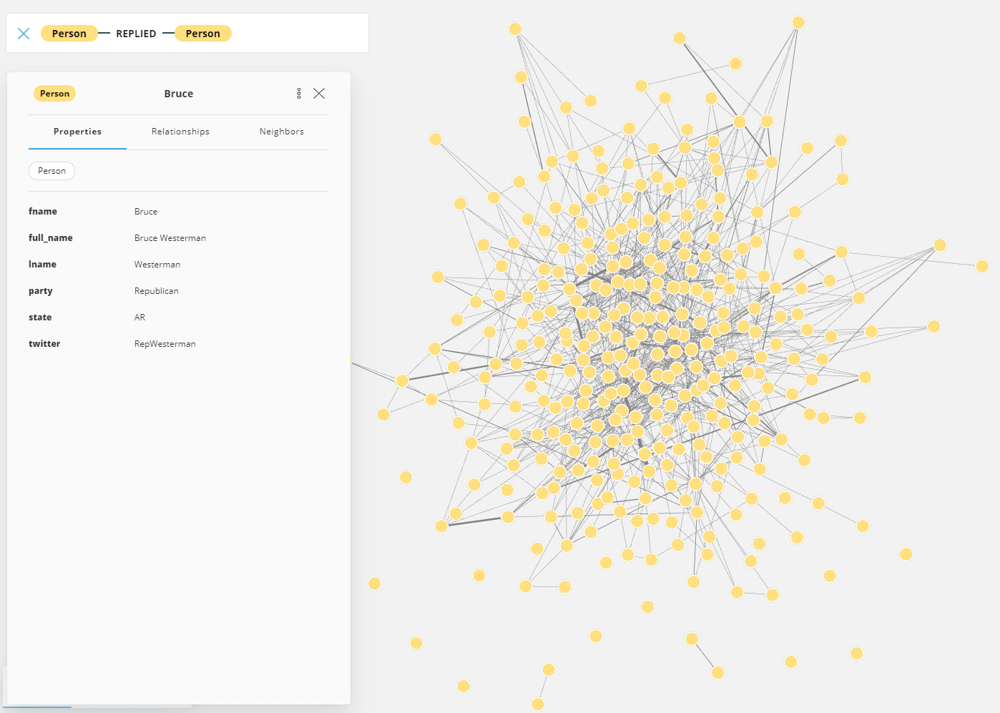
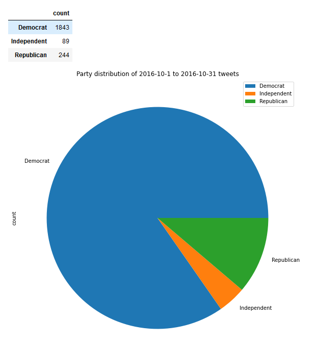

# Political Influencers
An analysis of the relationship of legislators based on their tweets to fellow legislators.

## Abstract
In this project, we create a system to look at Legislator tweet interconnectivity we look at the tweets made on Twitter by United States Legislators surrounding the 2016 presidential election. Using Neo4j, we can visualize these connections and determine high interconnectivity points. It also shows us overarching trends in Legislator behavior during the final days of the election, such as the tweet volume distribution from each political party.

## Introduction
Our team wanted to create a system that would be able to look at popular/ controversial events in a dataset of news articles, then cross reference those articles with tweets made by legislators around the same time. Using this subset of tweets we would then look at the interconnectivity between legislators and how the political parties interact with one another, as well as who's the most connected in such a graph. We accomplish this using Apache Solr and Neo4j, utilizing Redis as a cache, so that previous queries may be re-referenced very quickly.

We believe that this system could be used to see how events in the news are perceived and responded to in a political context, as well as how the political parties interconnect over said issues. 

## Methods

### Data systems
- Redis
    - Used as a cache to store Solr queries and their results.
- Apache Solr
    - Acts as a search engine to look through US news topics.
- Neo4j
    - Views legislator relationship networks
    - Expresses connections between different legislators surrounding newsworthy events.

### Pipeline implementation
Apache Solr
- Use UCSD internal Solr dashboard
- Run queries on subjects that we were looking to explore
- Import Python Requests to get outputs to parse

Redis
- Convert outputs of Solr queries into JSON 
- Create a dataframe for each query 
- Create a dictionary for the titles of the article (key) and their publish date (value) for each query
- Create a Redis pipeline to store each of the three dictionaries

Neo4j
- Load in legislator data from legislators-current.csv
- Fetch unique legislator twitter handles
- Create a subset of twitter tweets to reduce file size
  - Filter out any tweet that doesn’t originate from a legislator’s twitter handle
  - For our focus on replies, ensure the replied user is also a legislator
- Load the subsetted twitter tweets dataset
- Read the csv into neo4j, creating nodes for legislators, who they’re replying to in their tweet, and creating a relationship between the two.
  - The reply relationship holds the content of the tweet, as well as the date + time the tweet was created.

### Pipeline Usage
Fetch from Neo4j the network where one legislator replies to another legislator. Get tweeter and replyer of the tweet, as well as the tweet itself:

`
MATCH (p1:Person) - [r:REPLIED] -> (p2:Person)
WHERE r.create_date > DATE("2016-10-1") AND r.create_date < DATE("2016-12-30")
RETURN p1, r.text, p2
`

## Results
Using our system, we looked at the 2016 US presidential election. The results are summarized in the chart and pie graph below:

These results show that in October 2016, there was an overwhelming majority of Democrat legislators participating in Twitter discussions. We can see in the above chart that of the 2176 tweets made in the given time period, 1843 of those tweets, or ~84%, belonged to Democrats. 

## Discussion
Given the significantly larger proportion of Democrat tweets leading up to the 2016 November election, we believe that this could signify unrest in the Democrat party. This could be predictive of the coming Republican win in the election, possibly supported by the low amount of Republican tweet volume, showing the lower Republican worry about the election.

## Future Extensibility
Given its current state, this project pipeline is no longer usable, as it relied on a Solr database maintained on UC San Diego's internal servers. Future plans for this project could be to change up data reliances to instead use a dataset that's publically accessible. Another path of possible extensibility would be for this project to start scraping relevant tweets itself. This would allow the entire pipeline to remain almost totally unreliant on external datasets or changing schemas, allowing for continued functionality far into the future. The remaining accommodations that would have to be made would be to the code modules themselves, alongside Twitter's API or website schema.

## References
**All data sourced from Professor Amarnath Gupta at UCSD*